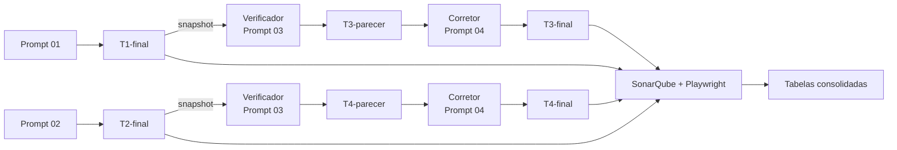

# Validações programáticas e por agentes na qualidade de código gerado por modelos de linguagem

Repositório do experimento do Trabalho de Conclusão de Curso do MBA em Engenharia de Software (USP/Esalq). O estudo, exploratório e quase-experimental, investiga se o **desenvolvimento guiado por testes (TDD)** e a **verificação por agente seguida de correção** alteram a qualidade estrutural e funcional do código gerado por modelos de linguagem.

**Status:** coleta, análise e texto do TCC concluídos (outubro de 2026). Os arquivos são mantidos como registro do estudo.

## Delineamento

As quatro condições geram a mesma aplicação: um catálogo de produtos para pequenas lojas, em React + Vite, Node.js e MongoDB.

| Condição | Geração | Verificação por agente seguida de correção |
|---|---|---|
| T1 | direta | — |
| T2 | com TDD | — |
| T3 | base congelada de T1 | sim |
| T4 | base congelada de T2 | sim |

- **Modelos (Claude Code 2.1.287, esforço low):** gerador e corretor Claude Sonnet 5.5; verificador Claude Opus 5.5.
- **Instrumentos comuns:** SonarQube (modo MQR, perfil Sonar way padrão) para a qualidade estrutural e uma suíte Playwright congelada por hash, com cinco cenários (P1–P5), para a avaliação funcional.
- **Comparações pareadas e descritivas:** T2−T1, T3−T1 e T4−T2; T4−T3 apenas descritiva.
- **Uma execução por condição (n = 1):** os resultados não admitem inferência estatística.

## Resultados principais

Valores consolidados em [`avaliacao/resultados/tabelas/resultados.md`](avaliacao/resultados/tabelas/resultados.md).

| Indicador | T1 | T2 | T3 | T4 |
|---|---|---|---|---|
| Cenários funcionais aprovados | 5/5 | 5/5 | 5/5 | 5/5 |
| Linhas de código | 644 | 671 | 709 | 752 |
| Complexidade cognitiva | 40 | 62 | 54 | 71 |
| Problemas de manutenibilidade | 10 | 9 | 11 | 10 |
| Densidade de problemas (por 1.000 linhas) | 15,53 | 13,41 | 15,51 | 13,30 |
| Linhas duplicadas | 0% | 0% | 0% | 0% |

Leitura descritiva, restrita a esta amostra:

- a suíte funcional atingiu o teto em todas as condições e não diferenciou os tratamentos;
- a verificação por agente seguida de correção aumentou o tamanho e a complexidade do código sem reduzir a densidade de problemas; nenhuma correção removeu problemas apontados pelo SonarQube;
- a geração com TDD resultou em menor densidade de problemas e maior complexidade cognitiva que a geração direta.

Discussão completa, limitações e ameaças à validade estão no texto do TCC.

## Estrutura do repositório

| Pasta | Conteúdo |
|---|---|
| [`prompts/`](prompts/) | Prompts de geração (T1, T2), do verificador e do corretor (T3, T4) |
| [`geracoes/`](geracoes/) | Snapshots congelados dos artefatos T1–T4, com pareceres e relatos de correção |
| [`avaliacao/`](avaliacao/) | Scripts de coleta e avaliação, suíte Playwright, configuração do SonarQube, registros e resultados |
| [`documentos/`](documentos/) | Registro de decisões e roteiro da coleta |

## Como reproduzir

O procedimento completo está em dois documentos:

1. [`documentos/ROTEIRO_COLETA.md`](documentos/ROTEIRO_COLETA.md): geração, verificação e correção com o Claude Code, congelamento e auditoria das sessões;
2. [`avaliacao/COMO_AVALIAR.md`](avaliacao/COMO_AVALIAR.md): preparação do ambiente, avaliação de cada condição e consolidação.

Ambiente usado na coleta (registrado em [`avaliacao/registros/versoes_ambiente.txt`](avaliacao/registros/versoes_ambiente.txt)):

| Componente | Versão |
|---|---|
| Sistema operacional | macOS 26.7.1 (arm64) |
| Claude Code | 2.1.287 |
| Node.js / npm | 20.20.2 / 10.8.2 |
| MongoDB (Docker) | `mongo:7.0` (7.0.43) |
| Playwright / Chromium | 1.49.1 / 131.0.6778.33 |
| SonarQube Community | 26.9.0.129388 |
| SonarScanner CLI | 8.1.0.6389 |
| Python | 3.8 ou superior (biblioteca padrão) |

Os scripts de coleta e de avaliação são escritos para macOS (usam `sw_vers` e `lsof`). A suíte está congelada pelo SHA-256 `ed6b7cc531641ab932b5ecdb4e2eb06720fb1fcd293141643dc24ceeeb8b1685`; qualquer alteração exige nova validação e a reavaliação das quatro condições.

Como os modelos de linguagem não são determinísticos, uma nova execução produzirá artefatos diferentes. O que se reproduz exatamente é a avaliação dos snapshots em `geracoes/`.

## Rastreabilidade

- **Decisões, desvios e eventos** da coleta e da redação: [`documentos/DECISOES_SESSAO_CLAUDE_CODE.md`](documentos/DECISOES_SESSAO_CLAUDE_CODE.md).
- **Sessões e esforço:** [`avaliacao/registros/`](avaliacao/registros/) (configuração de cada sessão, auditoria dos transcripts, duração, tokens e interações).
- **Versões dos artefatos:** cada snapshot traz um `ORIGEM.txt` com a marcação e o commit de origem. Esses commits pertenciam ao repositório de execução, externo a este; os snapshots em `geracoes/` são a cópia preservada (ver [`geracoes/README.md`](geracoes/README.md)).
- Alguns registros brutos contêm caminhos absolutos da máquina de coleta (`/Users/...`). Eles foram mantidos sem edição por serem saídas originais das ferramentas.

O texto do TCC, as entregas das etapas anteriores e o material de apoio do curso não são versionados, por conterem dados pessoais e material de terceiros.

## Uso de modelos de linguagem

Além de serem o objeto do estudo, modelos de linguagem foram usados como ferramenta de apoio: o Claude Code auxiliou na escrita dos scripts, na condução da coleta, na análise qualitativa e na revisão do texto e desta documentação, sempre sob supervisão do autor. As decisões correspondentes estão registradas no log de decisões.

## Como citar

Os metadados de citação estão em [`CITATION.cff`](CITATION.cff) (o GitHub oferece a opção "Cite this repository"). Referência no formato do TCC:

> Calciolari, R.M. 2026. project-llm-code-quality-experiment: Repositório do Experimento do Trabalho de Conclusão de Curso. GitHub. Disponível em: <https://github.com/Raphael-Marchetti-Calciolari/project-llm-code-quality-experiment>. Acesso em: [data].

## Licença

- Código (scripts de `avaliacao/` e artefatos de `geracoes/`): [MIT](LICENSE).
- Textos e dados (documentação, prompts, registros e resultados): [CC BY 4.0](LICENSE-CC-BY-4.0.md).

## Autoria

Raphael Marchetti Calciolari, com orientação de Vinicius Santos Andrade.
